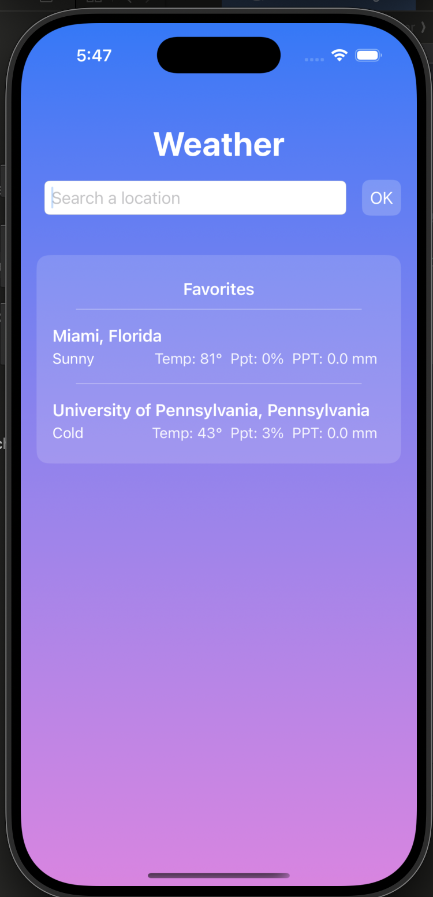
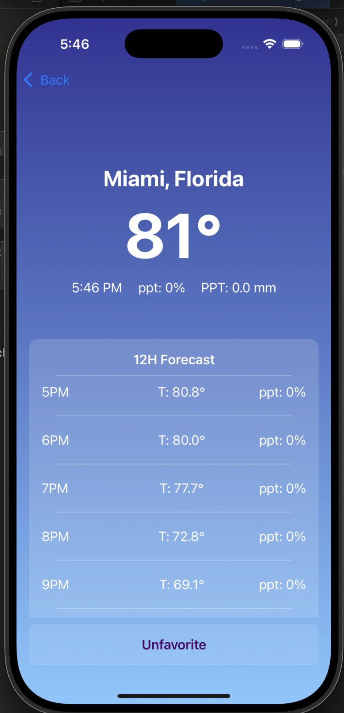
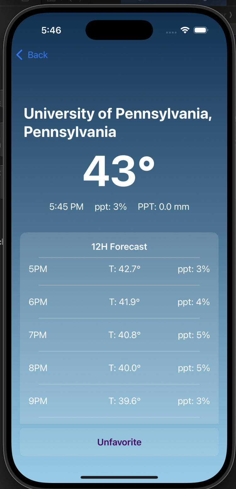

# WeatherApp

## Overview
The weatherApp is a simple iOS application, built with SwiftUI and SwiftData that allows users to search for a location by name (city, address, etc.) and display current and 12-hour forecast weather data for that location.

## Features
- **Home Screen**:
  - **Search Field**: Enter a location name.
  - **OK Button**: Triggers geocoding. If a matching location is found, navigates to the detail screen to display the weather.
  - **Favorites List**: Displays saved locations and other details including name, temperature, precipitation probability (ppt), and precipitation - (PPT). Tapping a favorite shows its detailed forecast screen.

  
- **Detail Screen**:
  - **Location Name**: Shows a formatted address (city/state) from the geocoding API.
  - **Current Weather**: Displays current temperature (`°F`), precipitation probability (ppt),  and precipitation - (PPT).
  - **12-Hour Forecast**: Lists the hourly temperature and precipitation probability.
  - **Favorite/Unfavorite Button**: Toggles whether the location is stored in the Favorites list.
  
  

## Architecture
1. **Models**:
   - `Location` (and `Address`): SwiftData models (`@Model`) representing locations. Conforms to `Decodable` for API responses.
   - `WeatherInfo` & `WeatherData`: Decodable structs for weather API responses, with custom `CodingKeys`.
2. **ViewModel** (`WeatherViewModel`):
   - Manages a list of favorite `Location` objects.
   - Handles adding/removing favorites and loading them from persistent storage.
3. **Persistence** (`PersistenceManager`):
   - Uses SwiftData’s `ModelContext` for creating, reading, updating, and deleting `Location` objects.
   - Ensures favorites are saved across app sessions.
4. **Networking** (`APIService`):
   - `getLocation(query:)`: Calls Nominatim geocoding API to decode the first matching location.
   - `getWeather(for:)`: Uses Open-Meteo to fetch hourly temperature, precipitation probability, and precipitation for up to 2 days.

## Setup & Usage
1. **System Requirements**:
   - macOS Ventura
   - Xcode 15 or later
   - Swift 5.8 or later

2. **Running the App**:
   - Clone this repository or download the ZIP.
   - Open `Weather.xcodeproj` in Xcode 15 or newer.
   - Select an iOS Simulator or a real device (iOS 15+ recommended).
   - Press **Run**.

3. **Searching for a Location**:
   - On the Home screen, enter a location into the search bar (e.g. "Philadelphia, PA").
   - Tap **OK**. If a location is found, you’ll be navigated to the detail screen.

4. **Viewing & Favoriting**:
   - Once on the detail screen, you’ll see temperature, precipitation probability, and a simple 12-hour forecast.
   - Tap **Favorite** to add this location to your list of favorites.
   - Return to the Home screen (by swiping back or tapping the back button), and you’ll see the location in the Favorites list.

5. **Unfavoriting**:
   - If you revisit a location already in your Favorites, the button changes to **Unfavorite**.
   - Tapping **Unfavorite** removes the location from the Favorites list and persistent storage.

## API References
- **Geocoding**: [Nominatim OpenStreetMap](https://nominatim.org/release-docs/latest/api/Search/)
- **Weather**: [Open-Meteo](https://open-meteo.com/)

